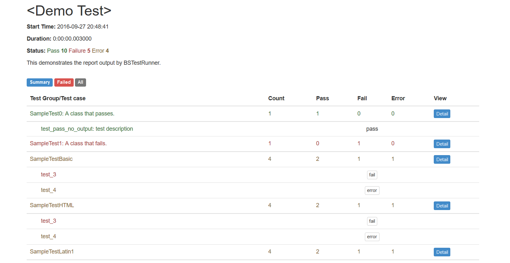

## BSTestRunner is bootstrap3 version of HTMLTestRunner



## How to use

A TestRunner for use with the Python unit testing framework. It generates a HTML report to show the result at a glance.

The simplest way to use this is to invoke its main method. E.g.

```python
import unittest
import BSTestRunner

if __name__ == '__main__':
    BSTestRunner.main()
```


For more customization options, instantiates a BSTestRunner object.
BSTestRunner is a counterpart to unittest's TextTestRunner. E.g.

```python
# output to a file
fp = file('my_report.html', 'wb')
runner = BSTestRunner.BSTestRunner(
            stream=fp,
            title='My unit test',
            description='This demonstrates the report output by BSTestRunner.'
            )

# Use an external stylesheet.
# See the Template_mixin class for more customizable options
runner.STYLESHEET_TMPL = '<link rel="stylesheet" href="my_stylesheet.css" type="text/css">'

# run the test
runner.run(my_test_suite)
```
